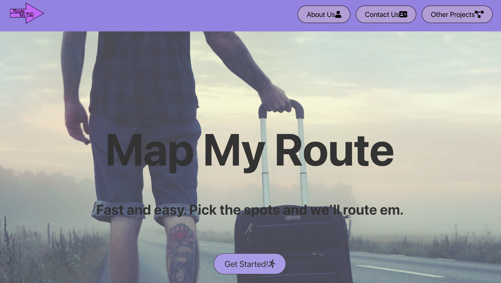
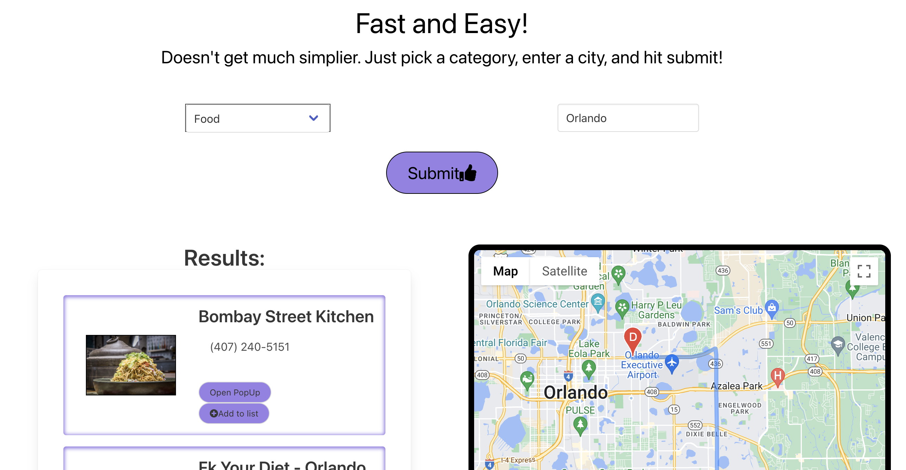
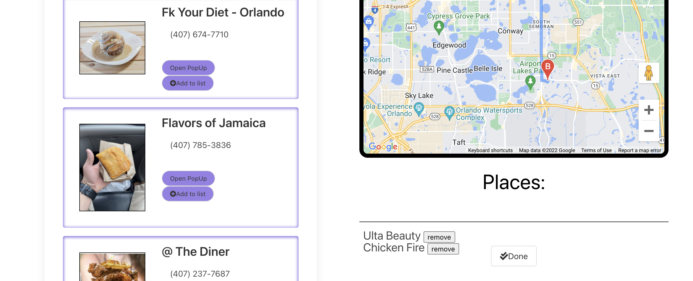

# Route my day

 ## Link to website:

 [Link to live site](https://odisclemons.github.io/route-my-day/)

 ## Screen Shots of Websites:
 
 
 >>
 
 >>
 
 

 ## Description:
  Route my day is a Yelp and Google powered website. This site provides travelers with a service to schedule their travel routes for daily trips. Utilizing Yelp's fusion API to find local business in a city of your choice and then adds them to a jQuery list to sort of and then complies data to render a map using google maps api. 

